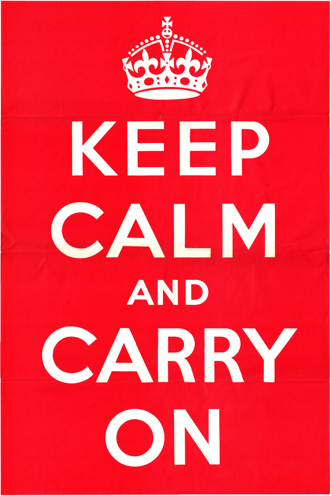

Some text here...

## Table

This is a table.

| Subject                         |      Date     |  Time |
|-------------------------------  |:-------------:|------:|
| Robotik I (N)                   |  29.07.2019   | 14:00 |

> Some quotes...

## $\KaTeX$ Is Gold!

More about $\KaTeX$ click [here](https://katex.org/docs/supported.html).

### $\KaTeX$ Example

#### $\KaTeX$ block

$\KaTeX$ block looks like this:

$$
R_\alpha (x) = \left(\begin{matrix}
  \cos \alpha & -\sin \alpha \\
  \sin \alpha & \cos \alpha
\end{matrix}\right) \cdot x
$$

#### $\KaTeX$ inline

$\KaTeX$ inline looks like this: $f(\alpha) = \cos \alpha - \sin \alpha$.

## Image Insertion

Example pic:

